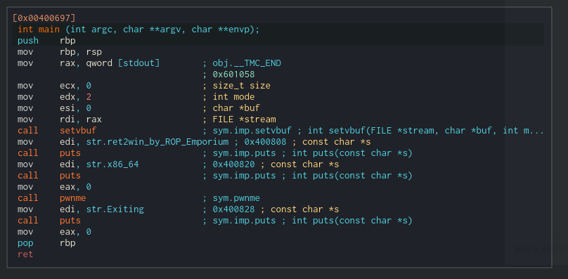
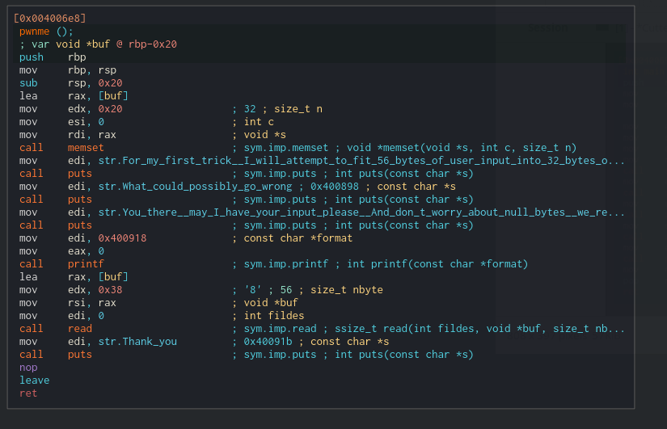

# Challenge 1 - Ret2win

## Disassembly
Let's start by disassembling the binary and start at main:



As can be seen it prints some information to the screen using puts and then calls pwnme. Let's take a look at pwnme.



In this function we have a buffer overflow. But how can we see that?

If we look at the first instructions of the function we can see that the function sets up a stack frame:

```C
push rbp        //Save old rbp
mov rbp, rsp    //Save old rsp
sub rsp, 0x20   //Move stack 0x20 further back 
```
This is a stack frame of the size 0x20. The function basically expects that all of the variables on the stack, combined will not exceed 0x20 in size.

If we look further down we can also see that a read call is performed:

```C
lea rax, [buf]
mov edx, 0x38
mov rsi, rax
mov edi, 0
call read
```
This is unnecessarily confusing as the ```lea rax, [buf]``` actually doesn't need to be there and can be replaced by an ```lea rsi [buf]``` so let's clean it up:

```C
mov rdi, 0
lea rsi, [buf]
mov rdx, 0x38
call read
```
To understand exactly what happens here we just need to know a tiny bit about GNU/Linux's calling convention.

## Calling convention

When arguments need to be passed to a function, values for the arguments are passed into the general purpose registers in a specific order (given that they are not floating point numbers). If there are too many arguments for the function, so that we run out of registers for this purpose, the rest are passed on the stack.

The calling convention goes as follows on GNU/Linux:
|Argument no.|Register|
|------------|--------|
|1|RDI|
|2|RSI|
|3|RDX|
|4|RCX|
|5|R8|
|6|r9|
|7..|On the stack|

We can then look up the corresponding man page for the function and check what the call would be. In this case it is read:

```
NAME
       read - read from a file descriptor

SYNOPSIS
       #include <unistd.h>

       ssize_t read(int fd, void *buf, size_t count);
```

So the call to read would be: 
```C 
read(0,*buf,0x38);
```

Basically reading 0x38 bytes from file descriptor 0 (stdin) into our buffer on the stack.

By basic math we can see that 0x38 is above 0x20, and therefore we have a buffer overflow.

Now that we are done with the reversing, let's get to the exploitation.

## Exploitation
