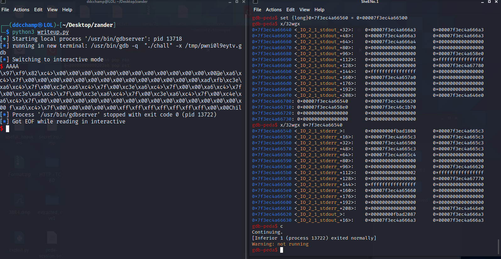

# ret2fd writeup

#Introduction
I was sent a challenge by my friend and teacher zanderdk. He provided me with a binary a linker and a libc file. Both the linker and the libc was version 2.23.
He told me I would likely need to stack pivot several times to solve it and the idea behind the challenge all revolved around messing with file descriptors to a point that calling exit would leak libc!
It sounded like a great challenge so I asked him to give me a quick introduction to everything which will be covered during this writeup.
A massive thank you to zander from Kalmarunionen for sending me this amazing challenge! :)

#The theory behind ret2fd
The general idea behind ret2fd is abusing the fd structure of stdout and stderr to leak an offset in libc. The structure can be seen below
#!!!INSERT IO_FILE_STRUCTURE

The first value in the file structure is a flag. This flag tells the kernel a variety of information about the file descriptor eg. whether or not it's buffered, is printing, or accessible.
For now all we need to know is that setting the flag to 0xfbad1800 will allow us to abuse stderr to print out an offset. In short, setting this flag will tell the kernel that stderr is currently printing and when exit then flushes the file descriptor (from highest to lowest) it will print out our data.
We will cover later what the specific flags mean along with why we need this specific one.

The next couple of values are pointers to ??!!!!???!!!???
The pointer we are interested in, in this case is the write_base_ptr\*. If this value is set to something lower than write_ptr\* and the 0xfbad1800 flag is set, it will print out all values found in between the write_base_ptr\* and write_ptr\*
An example of this can be tested by setting the flag and the write_base_ptr\* manually in gdb:

As can be seen on the image above, if we set the flag to be 0xfbad1800 and the write_base_ptr to point below write_ptr we will start printing out values between these two pointers.

But now we have another problem. We are calling exit after all! So how do we make sure that we can actually use this leak before the program closes?
Well that's where we're lucky that we have more than one file descriptor and that file descriptors contain another component call vtables.

And we continue to the exit call we can see that we print a bunch of addresses to the console
#Writing the exploit

Checksec:

The general idea lies behind the file descriptors being present in a read/write-able part of the binary. By stack pivoting to that area, making it our sta
